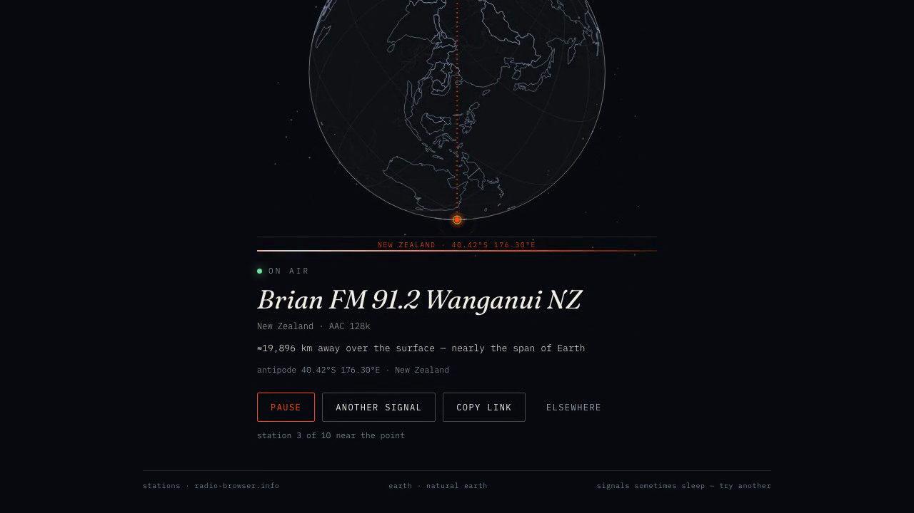

# Antípoda.fm



**Tune into the live radio station broadcasting nearest Earth's exact opposite point.**

**Live: [antipoda-fm.vercel.app](https://antipoda-fm.vercel.app)** · [launch video](docs/launch.mp4)

## What it does

Every radio app finds the station nearest you. This one points straight down, through the Earth.

Give it your location (geolocation, a place name, or a shared link) and it:

1. Computes your exact antipode — latitude flipped, longitude shifted 180°.
2. Draws the Earth as a slowly orbiting wireframe globe, with a dotted chord running through the planet between you and your opposite point.
3. Asks [Radio Browser](https://www.radio-browser.info/) for the geotagged stations nearest that point, in real distance order.
4. Connects and plays the first living stream it finds, falling back through the dial when a stream is dead — dead links are common on community radio directories.
5. Tells you the truth about what it found: how far the signal sits from the exact point, whether your antipode is open ocean (and where the nearest landfall is), or that the other side is simply silent.

Ocean antipodes, countries with no stations, dead streams, autoplay blocks — each gets its own honest state.

## How it works

Everything is client-side. No API keys, no backend, no tracking.

- **The antipode** is pure math: `lat' = -lat`, `lon' = lon + 180` normalized into `[-180, 180]`.
- **The globe** is a `<canvas>` orthographic projection. Coastlines come from bundled Natural Earth 110m polygons, converted to 3D unit vectors once and clipped per frame against the visible hemisphere. The camera orbits incrementally around the chord axis — no quaternion flips, and it renders a single frame when `prefers-reduced-motion` is set.
- **Country lookup** unwraps every polygon ring at load (longitudes adjusted ±360 to stay continuous), so point-in-polygon survives the antimeridian — Russia and Fiji don't break it. The Antarctic polar cap is contained explicitly because the dataset truncates near 84°S.
- **The resolver** uses Radio Browser's real proximity search (`geo_lat`, `geo_long`, `geo_distance`, `order=geo_distance`) with widening radii, then tops up from the containing or nearest country's stations. Stations report coordinates, so the distances shown are measured, not claimed.
- **The player** wraps one `<audio>` element with attempt tokens — a stale promise or a dead stream's late error can never overwrite a newer station. HLS playlists route through `hls.js` (lazy-loaded) unless the browser plays them natively. Autoplay denial lands you on a paused card with a Listen button, not an error.
- **Share links** carry coarsened coordinates (`?lat=..&lon=..`, two decimals), enough to reproduce the tune without pinning your block.

## Run it locally

```bash
npm install
npm run dev     # http://localhost:5173
npm run build   # production build to dist/
npm run preview # serve the build
```

## Stack

Vite · React 19 · TypeScript · `<canvas>` globe (no WebGL) · `hls.js` on demand · [Radio Browser API](https://api.radio-browser.info/) · [Open-Meteo geocoding](https://open-meteo.com/) · Natural Earth 110m (bundled) · Fraunces + IBM Plex Mono

## License

MIT. Stations belong to their broadcasters; Radio Browser is a community directory.
